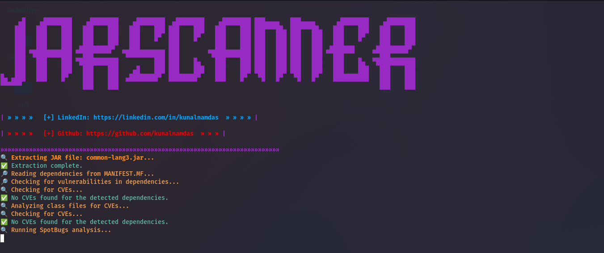
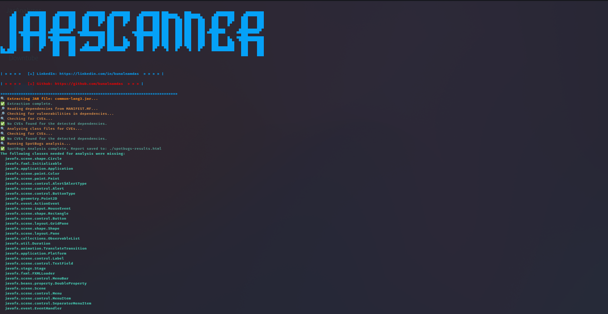
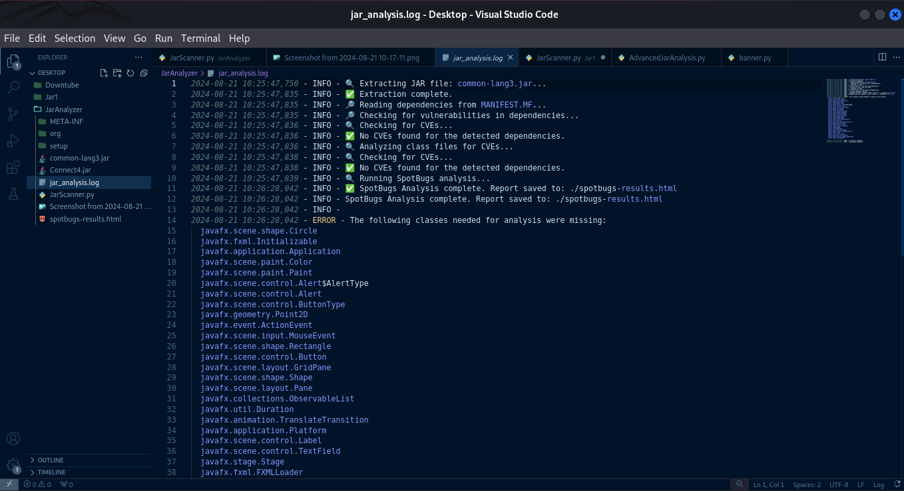
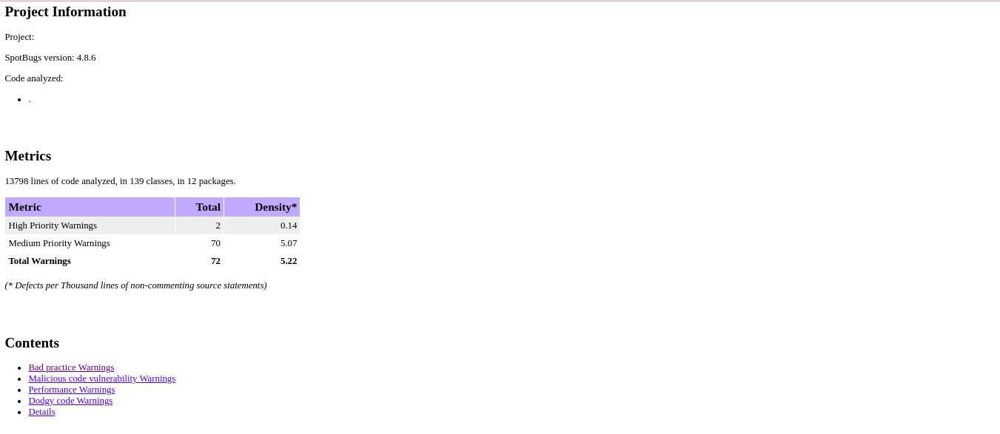

# JarScanner

# JAR File Vulnerability Analysis Tool

This tool is designed to analyze Java JAR files for potential vulnerabilities by extracting their contents, analyzing dependencies, scanning for CVEs, and running static code analysis using SpotBugs. The results are then output to an HTML report.

## Features

- **JAR File Extraction:** The tool extracts the contents of a JAR file to a specified directory.
- **Dependency Analysis:** The tool reads the `MANIFEST.MF` file for dependencies and checks them for known CVEs using the National Vulnerability Database (NVD) API.
- **Class File Analysis:** It scans class files for potential vulnerabilities.
- **SpotBugs Integration:** SpotBugs is used to perform static code analysis on the extracted files, generating an HTML report.
- **Logging:** Detailed logs are recorded for every step of the process, stored in `jar_analysis.log`.
- **Graceful Termination:** The tool includes a signal handler to handle `Ctrl+C` interrupts gracefully.






## Requirements

- Python 3.x
- SpotBugs
- Required Python modules: `requests`, `argparse`, `zipfile`, `termcolor`, `logging`
- Ensure the `setup` directory is present with the following modules:
  - `sprint.py`
  - `colors.py`
  - `banner.py`

## Installation

1. **Clone the repository:**
   ```bash
   git clone https://github.com/kunalnamdas/JarScanner.git
   cd JarScanner
   ```

 ## 2 Install Python dependencies: 

 pip install -r requirements.txt

## 3 Install SpotBugs:

Ensure that SpotBugs is installed and available in your system's PATH. You can download it from the official SpotBugs website.

# Usage

- To analyze a JAR file, use the following command:

- python JarScanner.py <path_to_jar_file> <output_directory>

- Example:

- python JarScanner.py sample.jar analysis_output

This command will extract the contents of sample.jar to the analysis_output directory, check for vulnerabilities, and generate a SpotBugs report.

## Logging

- All actions performed by the tool are logged in jar_analysis.log. You can review this file for a detailed record of the analysis process.


## Error Handling

- The tool is equipped with error handling and will provide informative messages if something goes wrong. All errors are logged to the log file.

## Graceful Exit

- Press Ctrl+C at any time to terminate the tool. It will exit gracefully and log the termination event.

## License

- This project is licensed under the MIT License - see the LICENSE file for details.

## Contribution

- Contributions are welcome! Please fork the repository, make your changes, and submit a pull request.


## Developer
### Kunal Namdas


   
